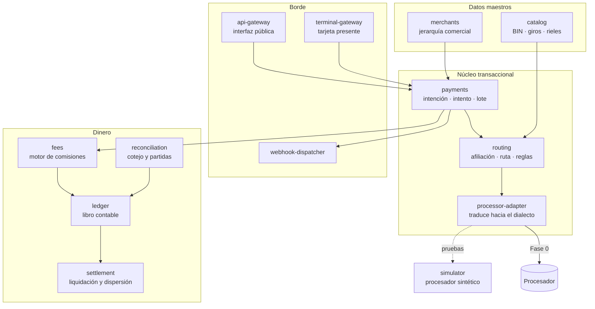
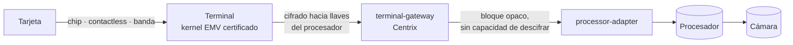
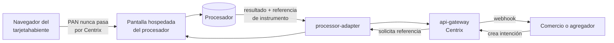
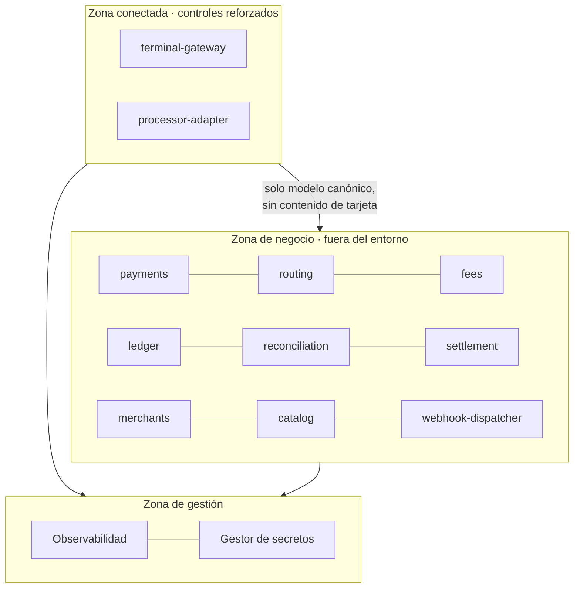

# Centrix · 3.1 Mapa de servicios · 3.2 Flujo de datos · 3.3 Perímetro · 3.4 Evidencia de llaves

**Capa 3 · Arquitectura e infraestructura** · Versión 0.3 borrador · 16 de agosto de 2026 · Interno confidencial

Depende de: 0.2 Modelo canónico · 0.4 Reglas irrevocables · 2.2 DDL · 2.5 Clasificación de datos

> **Registro único de preguntas abiertas.** Todas las preguntas abiertas viven en el documento
> 0.3, **Parte VI**, con identificador propio. Este documento las referencia y no las reenuncia.

Alimenta: 7.1 Alcance PCI y análisis de brecha · 6.4 Matriz de responsabilidades compartidas

> **Advertencia de alcance.** Este documento propone un perímetro. **La determinación de alcance la
> hace el evaluador calificado, no Centrix.** Lo que aquí se declara es el diseño y la evidencia con
> la que Centrix sostendrá su posición, no una conclusión de conformidad.

---

# 3.1 · Mapa de servicios del piloto

## 1. Criterio

Un servicio por frontera de propiedad de datos. La partición sale del esquema ejecutado (documento
2.2): **ningún servicio escribe en tablas de otro**, y las referencias entre esquemas son por
identificador, sin clave foránea.

**Nada más y nada menos que lo que el piloto necesita.** Cada servicio es superficie que hay que
revisar, y la revisión es el cuello de botella (R7).

---

## 2. Servicios

| Servicio | Posee | Entra al piloto |
|---|---|---|
| `api-gateway` | Idempotencia, autenticación de cliente, alcance | Sí |
| `terminal-gateway` | Inbox y deduplicación propia de terminal | Sí |
| `payments` | Intención, intento, captura, devolución, lote | Sí |
| `routing` | Decisión de ruteo, reglas, velocity, listas | Sí |
| `processor-adapter` | Traducción canónico ↔ dialecto | Sí |
| `token-codec` | Ensamblado y lectura de los datos privados del dialecto | Fase 1 |
| `fees` | Esquemas y evaluaciones de comisión | Sí |
| `ledger` | Libro contable | Sí |
| `reconciliation` | Movimientos y partidas | Sí |
| `settlement` | Liquidación y dispersión | Sí |
| `merchants` | Jerarquía comercial y cascadas | Sí |
| `catalog` | Datos maestros | Sí |
| `webhook-dispatcher` | Entrega, firma, reintentos | Sí |
| `simulator` | Procesador sintético, ambos canales | Sí, fuera de producción |

**Trece servicios es mucho para cuatro personas.** Se acepta porque la partición sigue la propiedad
de datos y no la comodidad, y porque revertirla después es más caro. Se mitiga con plantilla de
servicio (documento 4.2): un servicio nuevo no se escribe desde cero.

**`token-codec` no estaba en el diseño original, y solo aparece al leer una especificación real**
(D48). El campo de datos privados de la cámara no es un campo: es un sub-protocolo con cabecera,
identificador de token, longitud declarada y subcampos posicionales. La librería de mensajería elegida
resuelve TLV y BER-TLV, no esto. Vive **dentro** del adaptador y es declarativo: un token nuevo es una
definición, no código.

**`processor-adapter` es el único que conoce un dialecto.** Es la frontera de la regla irrevocable 8.
Si un nombre de campo numerado aparece fuera de este servicio, es defecto.

---

# 3.2 · Topología y flujo de datos de tarjeta

## 3. Qué responde este documento

Por dónde entra el dato de tarjeta, por dónde sale, dónde se cifra, y **dónde no existe**. Es el
primer documento que pide un evaluador y el que determina el alcance real.

---

## 3 bis. Dos canales de salida, no uno

La especificación de la cámara impone una separación que el diseño no contemplaba:

| Canal | Para qué | Restricción |
|---|---|---|
| **Cifrado con derivación de llave por transacción** | Tarjeta presente | **No puede ir por el canal de transporte estándar** |
| **Transporte estándar cifrado** | Comercio electrónico y administración | — |

Son dos rutas de conectividad con **gestión de llaves y segmentación distintas**. Eso añade un módulo
a la infraestructura como código y toca la definición del perímetro: la frontera del entorno de datos
de tarjeta ya no es un solo punto de salida.

**Y es lo que resuelve la compuerta E3 a favor.** Para los datos de banda en tarjeta presente, la
especificación ofrece **dos opciones**: token cifrado por el canal con derivación de llave, o campo en
claro. **No es un mandato de banda en claro: es una alternativa.** Existiendo la opción cifrada, la
decisión D1b sobrevive y la reducción de alcance se mantiene.

Con una condición que hay que registrar: en chip y banda hay que enviar la pista completa y el código
de verificación dentro de un token cifrado. Centrix no los descifra, pero los transporta — y cuando
sea adquirente directo necesitará gestión de llaves propia, que es el disparador de D35.

---

## 4. Tarjeta presente

**La terminal cifra hacia llaves del procesador. Centrix transporta un bloque opaco.** Decisión D1b y
regla irrevocable 3.

Lo que Centrix sí ve y persiste: importe, moneda, modo de captura, marca, últimos dígitos, resultado,
identificadores de red. Todo ello dato de titular o transaccional, ninguno prohibido.

Lo que Centrix nunca ve: número de cuenta principal en claro, datos de pista, bloque de PIN
descifrable.

**Consecuencia:** el `terminal-gateway` transporta contenido cifrado que no puede descifrar. Es
sistema conectado al entorno, no sistema que almacena, procesa o transmite datos en claro. **La
clasificación exacta la determina el evaluador**; la posición de Centrix se sostiene con la evidencia
del apartado 3.4.

---

## 5. Comercio electrónico · el punto que decide el alcance

Aquí está el problema real, y hay que ponerlo por escrito con crudeza.

**La interfaz publicada del procesador de Fase 0 recibe el número de tarjeta en claro.** Tanto en el
cobro directo como en la tokenización como en el registro de autenticación. Si Centrix consume esos
endpoints, entra al entorno de datos de tarjeta y se pierde toda la reducción de alcance que D1b
compra en tarjeta presente.

### Camino elegido: pantalla hospedada por el procesador

**El número de tarjeta va del navegador al procesador sin tocar Centrix.** Centrix recibe el
resultado y una referencia de instrumento no sensible.

**Consecuencia sobre el faseo, y hay que decirla:** el checkout hospedado (requisito 4.21) estaba en
F0-Producto, fuera del piloto, porque el primer cliente es un agregador que integra por interfaz.
**Sube a F0-Piloto** — no por producto, sino porque es lo que sostiene el alcance.

### Caminos descartados y por qué

| Alternativa | Por qué se descarta |
|---|---|
| Centrix consume el cobro directo con datos en claro | Rompe R3 y anula la reducción de alcance completa |
| Centrix tokeniza llamando al endpoint de tokenización | Mismo problema: recibe el número en claro para tokenizar |
| El cliente tokeniza por su cuenta y pasa la referencia a Centrix | **Viable.** Traslada el alcance al cliente: es conversación comercial, no técnica. Queda como alternativa |

**La tercera merece discusión con el primer cliente.** Un agregador con su propio entorno certificado
puede preferirla. No es peor: es distinta, y hay que ofrecerla.

---

## 6. Autenticación 3DS

El registro de autenticación del procesador también recibe el número en claro. **Se consume desde la
pantalla hospedada, no desde Centrix.** Si eso no fuera posible, el comercio electrónico del piloto
queda condicionado a la compuerta B13 y al alcance ampliado.

---

# 3.3 · Perímetro del entorno de datos de tarjeta

## 7. Zonas

**Dos servicios en la zona conectada, once fuera.** Esa proporción es el resultado de D1b y es lo que
hace defendible el alcance.

## 8. Controles de segmentación

| Control | Aplicación |
|---|---|
| Red | Subredes separadas, sin ruta directa desde la zona de negocio hacia el procesador |
| Tráfico | Solo el `processor-adapter` alcanza el destino externo; regla explícita de salida |
| Datos | Lo que cruza hacia la zona de negocio es modelo canónico; el contenido cifrado no cruza |
| Identidad | Rol de servicio distinto por zona; sin credenciales compartidas |
| Registro | Todo cruce de zona se registra |
| Verificación | Prueba de segmentación periódica, no solo diseño |

**La regla que hace verificable la segmentación:** ningún servicio de la zona de negocio tiene acceso
de red al procesador ni al bus de la zona conectada. Se comprueba con una prueba automatizada que
intenta la conexión y espera que falle.

## 9. Dependencias que entran al alcance

| Componente | Razón |
|---|---|
| Librería de códec de mensajería (Fase 1) | Manipula contenido de tarjeta |
| Gestor de secretos | Custodia credenciales del entorno |
| Registro centralizado | Recibe trazas de la zona conectada |
| Servicio de criptografía de pagos (Fase 1) | Opera con llaves |
| Nube subyacente | Con matriz de responsabilidades compartidas |

Cada uno entra al inventario de componentes con monitoreo de vulnerabilidades (documento 4.7).

---

# 3.4 · Evidencia de no acceso a llaves de descifrado

## 10. Por qué existe este documento

**El auditor no acepta la afirmación. Acepta la evidencia.**

Toda la reducción de alcance descansa en que Centrix no puede descifrar contenido de tarjeta. Si esa
evidencia no se diseña desde el inicio, la posición no es defendible y el ahorro que justifica la
arquitectura entera se pierde en la evaluación formal.

Diseñarla ahora cuesta poco. Reconstruirla después de un año de producción es, en la práctica,
imposible para los periodos anteriores.

---

## 11. Evidencia por tipo

### De diseño
- Este documento, con los diagramas de flujo vivos y versionados
- Especificación de integración con el procesador, con el punto de cifrado declarado (documento 1.9)
- Registro de decisiones con D1b, su contexto y sus alternativas descartadas

### De configuración
- **Inventario de llaves con propósito declarado.** Centrix custodia llaves de transporte,
  autenticación de cliente y firma de webhooks. **Ninguna llave de descifrado de contenido de
  tarjeta.**
- Configuración del gestor de secretos, con la lista completa de secretos y su tipo
- Registro de accesos al gestor de secretos, retenido doce meses

### De código
- Ausencia verificada de operación de descifrado de contenido de tarjeta en todo el árbol
- Control en el pipeline que falla la construcción si aparece
- Esquema sin columna para número de cuenta ni código de seguridad, **verificado ejecutando el DDL**

### De operación
- Registros que muestran el bloque cifrado entrando y saliendo sin transformación
- Prueba automatizada que verifica que el bloque de salida es idéntico al de entrada

**La última es la más contundente y la más barata.** Una prueba que demuestra que el dato sale
byte a byte igual que entró prueba que no se descifró, y corre en cada construcción.

---

## 12. Lo que rompería esta evidencia

**La excepción de banda en claro.** Si el procesador exige envío de datos de banda sin cifrar para
alguna marca, esta evidencia deja de sostenerse en ese camino, y el alcance vuelve al máximo.

Compuerta **E3**, sin resolver. Es una pregunta de un correo y decide meses de trabajo.

**Y si la respuesta es que sí lo exige**, la evidencia no se abandona: se acota. Se documenta que el
descifrado ocurre únicamente en ese camino, para esa marca, y se aísla el componente. Un alcance
ampliado y delimitado es mucho mejor que un alcance ampliado y difuso.

---

## 13. Abierto

Afectan a estos documentos: **P21** (excepción de banda en claro, compuerta E3, que determina si el
apartado 12 aplica), **P40** (si la pantalla hospedada cubre los casos de uso del primer cliente),
**P41** (clasificación del gateway de terminal por el evaluador), **P44** (contratación del evaluador
calificado) y **P51** (prueba de segmentación).

Ver el registro consolidado en el documento 0.3, Parte VI.

---

*Centrix · Capa 3 · Documentos 3.1 a 3.4 · Interno confidencial*
